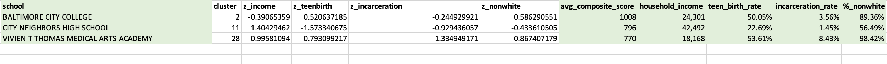
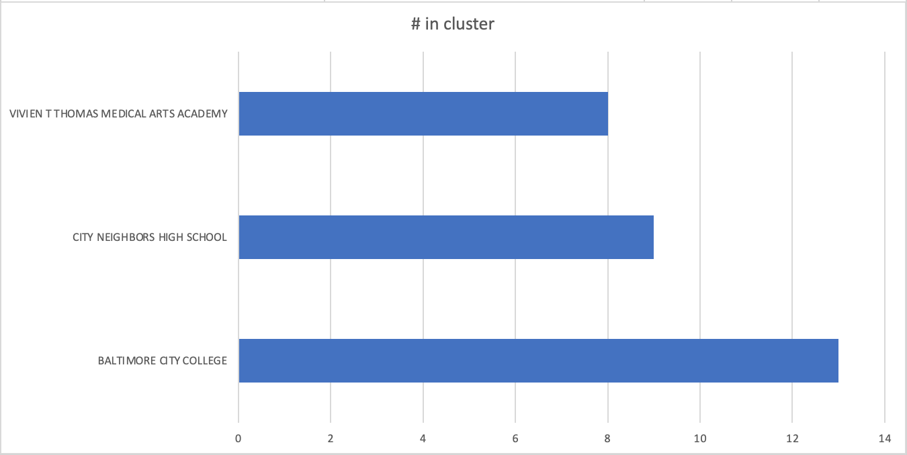
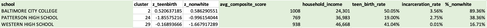
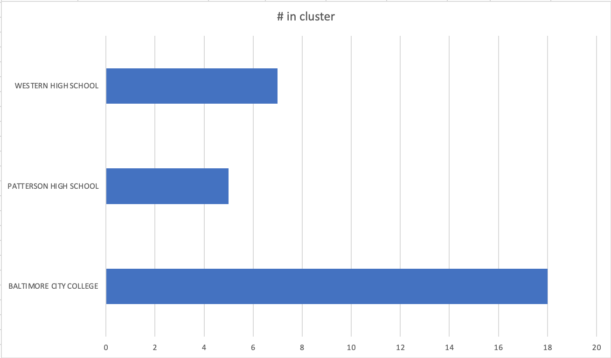

# Comparing Social Metrics With School Performance Metrics

## Background
Access to higher education serves as a substantical obstacle to socioeconomic growth for the lower class of the United States. In a [study](https://www.researchgate.net/publication/280232788_Race_Poverty_and_SAT_Scores_Modeling_the_Influences_of_Family_Income_on_Black_and_White_High_School_Students'_SAT_Performance) conducted by the University of Pennsylvania and the University of Southern California, researchers found that students from upper-class families performed disproportionately better than their lower-class peers on the SAT. Additionally, the difference in scores between high-income and low-income students was found to be twice as large among black students in comparison to white students. Considering the importance of standardized test scores during the college application process, this disparity clearly indicates the educational inequality experienced by uneducated, predominantly black communities in the US.

In this project, we decided to focus on Baltimore's notoriously [subpar public education system](https://www.arcgis.com/apps/Cascade/index.html?appid=3ddf7ded140d4dc38bedc27d6c0e44f7#:~:text=Because%2080%20percent%20of%20students,were%20experienced%20by%20black%20children.). By comparing social metrics like household income, incarceration rate, teenage birth rate, and percentage of non-white residents to high school test scores, our objective is to show a distinct relationship between underserved black communities and lower SAT scores.

Admittedly, SAT test scores are not a perfect measurement of the educational achievement of individual communities in Baltimore. However, our focus on access to higher education necessarily emphasizes the importance of standardized test scores. Our goal is not to analyze the city's public education system as a whole, but rather to determine whether distinctive linkages exist between social metrics and SAT scores in Baltimore.

## Business Question
Are specific areas in the Baltimore high school system more underserved or neglected than others? Is this relationship a result of the social metrics examined, or is there a more general, systemic explanation? What social metrics, if any, should be focused on when attempting to alleviate the educational shortcomings of Baltimore's public education system?

## Data Question - Open Data

The data used in this project was gathered from [The Opportunity Atlas](https://www.opportunityatlas.org/) and the [Baltimore City Public Schools Open Data](https://www.baltimorecityschools.org/data).
The original data files can be found in the repository [here](https://github.com/AdamShmanske/Comparing-social-metrics-with-school-performance-metrics/tree/main/source_data).

1. [SAT_rawdata](https://github.com/AdamShmanske/Comparing-social-metrics-with-school-performance-metrics/blob/main/source_data/SAT_rawdata.xlsx) contains SAT data from each of the high schools in the Baltimore Public Education system.
2. [school_census_shimano](https://github.com/AdamShmanske/Comparing-social-metrics-with-school-performance-metrics/blob/main/source_data/school_census_shimano.xlsx) contains data received from Professor Shimano, which pairs schools in the Baltimore Public Education system with specific tracts.
3. [incarceration_rawdata](https://github.com/AdamShmanske/Comparing-social-metrics-with-school-performance-metrics/blob/main/source_data/incarceration_rawdata.xlsx), [income_rawdata](https://github.com/AdamShmanske/Comparing-social-metrics-with-school-performance-metrics/blob/main/source_data/income_rawdata.xlsx), [nonwhite_rawdata](https://github.com/AdamShmanske/Comparing-social-metrics-with-school-performance-metrics/blob/main/source_data/nonwhite_rawdata.xlsx), and [teenbirth_rawdata](https://github.com/AdamShmanske/Comparing-social-metrics-with-school-performance-metrics/blob/main/source_data/teenbirth_rawdata.xlsx) all contain social metrics data gathered from the Opportunity Atlas database.

Microsoft Excel was used to answer:
* **What, if any, is the relationship between SAT performance and household income, percentage of non-white residents, incarceration rate, and teen birth rate?** Used individual linear regression and multiple linear regression to determine whether or not a numerical relationship could be determined between the factors used for analysis.
* **Can the dataset be effectively grouped into distinct clusters based on the relationship between SAT scores and the social metrics that were examined?** Used cluster analysis to try and separate the high schools into distinctive groupings.

# Data Answer

Using graphs and important values, the below section contains the numerical details and findings of our analysis.

## Linear Regression

### Single Linear Regression - Household Income
 
### Single Linear Regression - Incarceration Rate

### Single Linear Regression - Teen Birth Rate

### Single Linear Regression - Percentage of Non-white Residents

### Multiple Linear Regression

## Cluster Analysis
Two separate cluster analyses were performed, in accordance with the above findings. The first cluster analysis (All Metrics) was conducted using all four social metrics. The second cluster analysis (Partial) was only based upon the percentage of non-white residents and the teenage birth rate, due to the lack of significance of the other values indicated by the large p-values - see "mlr" tab of [midterm_project_analysis](https://github.com/AdamShmanske/Comparing-social-metrics-with-school-performance-metrics/blob/main/midterm_project_analysis.xlsx).

### Cluster Analysis - All Metrics

The above image displays the cluster points generated by the solver tool.

* Baltimore City College has the highest scoring, but falls in the middle for all social metrics. These high scores may be the result of the fact that this school is a city college, with a much older student body than the typical high school.
* City Neighbors Highschool falls in the middle for scoring, but has noticably better social metrics and a much lower non-white population than the other clusters. The higher social metrics may be a result of the fact that City Neighbors is a charter school, and may be in a better area than the other two cluster points.
* Vivien T. Thomas Medical Arts Academy has the lowest test scores, along with the lowest social metrics and the highest percentage of non-white residents. Vivien T. Thomas is a traditional high school in a characteristically underserved area of Baltimore.

The above graph displays the number of schools that are associated with each cluster point.

### Cluster Analysis - Partial

The above image displays the cluster points generated by the solver tool. Only percentage of non-white residents and teenage birth rate were used to determine the clusters shown above.

* Baltimore City College emerges as a cluster point again. It has the highest teenage birth rate and the highest percentage of non-white residents, but also the highest test scores. Again, these high scores may be a result of the fact that this institution is a city college, not a high school.
* Patterson High School has the lowest test scores, the lowest teen birth rate, and falls in the middle for non-white residents. Again, this result may be area based.
* Western High School's test scores are nearly as high as Baltimore City College's, but the surrounding area has the lowest percentage of non-white residents and falls in the middle for teenage birth rate.

### Cluster Analysis - Observations
The full cluster analysis displays results that mostly aligns with the expected conclusion. There seems to be a relationship between higher scoring and higher household income, lower incarceration rates, lower teenage birth rates, and lower percentage of non-white residents. This is most evidently indicated by the disparity between City Neighbors High School and Vivien T. Thomas Medical Arts Academy.

The results from the partical cluster analysis are a little more inconclusive than the full cluster analysis. Patterson High School has the lowest test scores, but all has the lowest teenage birth rate and falls in the middle for non-white residents. Baltimore City College again emerges as the cluster point with the highest test scores, but the surrounding area also has the highest teenage birth rate and the highest percentage of non-white residents.

The irregularity of these conclusions may largely be the result of a location bias. Since commuter institutions like Baltimore City College and charter schools were included alongside distric-specific high schools, some of the data may not be representative of the actual student body in each school. However, the data analysis largely points to the expected conclusion that underserved communities possess an inherent tendency towards lower test scores.

## Data Application and Business Answer

### Linear Regression

### Cluster Analysis
The cluster analysis was not clearly representative of the expected results, but still demonstrates a distinct relationship between social metrics and test scores. Distinctive groups emerged from the data, which effectively display the disparity of test scores between priviliged and underpriviliged areas in Baltimore. It is perhaps worth noting that the vast majority of school test scores in Baltimore fall below the [national average of 1068](https://www.princetonreview.com/college-advice/good-sat-scores#:~:text=A%20perfect%20SAT%20score%20is,class%20of%202018%20was%201068.). 

### Conclusion
